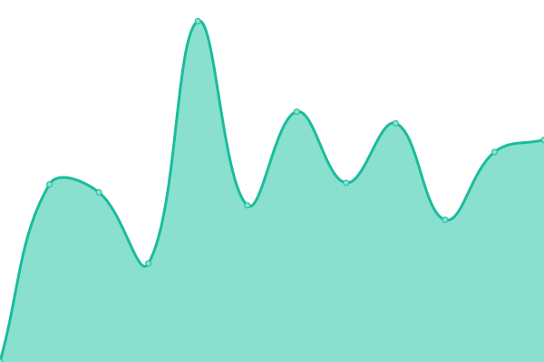
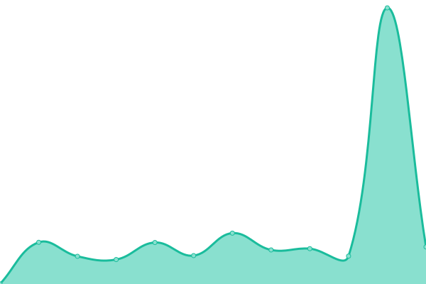
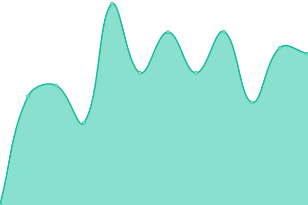
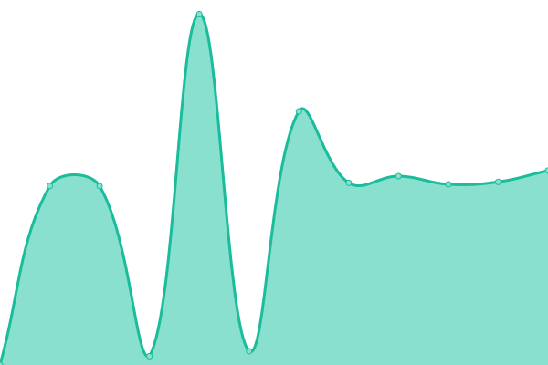

# [📈 Live Status](https://status.merginmaps.com): <!--live status--> **🟩 All systems operational**

This repository contains the open-source uptime monitor and status page for [Mergin Maps](https://merginmaps.com), powered by [Upptime](https://github.com/upptime/upptime).

With [Upptime](https://upptime.js.org), you can get your own unlimited and free uptime monitor and status page, powered entirely by a GitHub repository. We use [Issues](https://github.com/MerginMaps/status/issues) as incident reports, [Actions](https://github.com/MerginMaps/status/actions) as uptime monitors, and [Pages](https://status.merginmaps.com) for the status page.

<!--start: status pages-->
<!-- This summary is generated by Upptime (https://github.com/upptime/upptime) -->
<!-- Do not edit this manually, your changes will be overwritten -->
<!-- prettier-ignore -->
| URL | Status | History | Response Time | Uptime |
| --- | ------ | ------- | ------------- | ------ |
|  [Main Website](https://merginmaps.com/?utm_source=mmsystemstatus) | 🟩 Up | [main-website.yml](https://github.com/MerginMaps/status/commits/HEAD/history/main-website.yml) | 

 800ms
     
 | 

<a href="https://status.merginmaps.com/history/main-website">100.00%</a>
    

|  [Translated Website](https://fr.merginmaps.com/?utm_source=mmsystemstatus) | 🟩 Up | [translated-website.yml](https://github.com/MerginMaps/status/commits/HEAD/history/translated-website.yml) | 

 1045ms
     
 | 

<a href="https://status.merginmaps.com/history/translated-website">100.00%</a>
    

|  [Dashboard and API](https://app.merginmaps.com/ping?utm_source=mmsystemstatus) | 🟩 Up | [dashboard-and-api.yml](https://github.com/MerginMaps/status/commits/HEAD/history/dashboard-and-api.yml) | 

 450ms
     
 | 

<a href="https://status.merginmaps.com/history/dashboard-and-api">100.00%</a>
    

|  [Docs](https://www.merginmaps.com/docs/?utm_source=mmsystemstatus) | 🟩 Up | [docs.yml](https://github.com/MerginMaps/status/commits/HEAD/history/docs.yml) | 

 628ms
     
 | 

<a href="https://status.merginmaps.com/history/docs">100.00%</a>
    

|  [RSS Feed](https://www.merginmaps.com/rss/qgis?utm_source=mmsystemstatus) | 🟩 Up | [rss-feed.yml](https://github.com/MerginMaps/status/commits/HEAD/history/rss-feed.yml) | 

 2599ms
     
 | 

<a href="https://status.merginmaps.com/history/rss-feed">100.00%</a>
    

<!--end: status pages-->

[**Visit our status website →**](https://status.merginmaps.com)

## 📄 License

- Powered by: [Upptime](https://github.com/upptime/upptime)
- Code: [MIT](./LICENSE) © [Mergin Maps](https://merginmaps.com)
- Data in the `./history` directory: [Open Database License](https://opendatacommons.org/licenses/odbl/1-0/)
